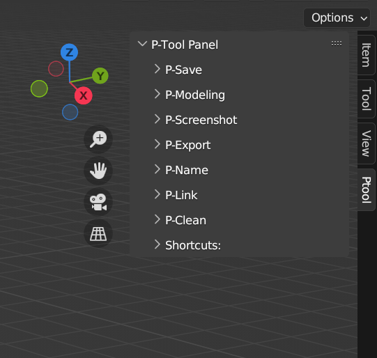

# P-Tool

Everyday pipeline helpers for Blender: save versions, name objects, export FBX and tidy up selected meshes.

[Download the updated add-on](https://github.com/adrien-blanchard/p-tool/releases/latest) · [Original Gumroad download](https://totbproduction.gumroad.com/l/p-tool)



Created by Adrien Blanchard in 2023 while studying, and now maintained for current Blender. The image above comes from the original Gumroad listing.

## Inside the toolkit

- **P-Save:** numbered copies in `__versionning`, with optional artist initials.
- **P-Modeling:** move objects to the world origin, or set an origin from selected vertices.
- **P-Screenshot:** individual viewport captures.
- **P-Export:** selected meshes or an armature and its animation to FBX.
- **P-Name:** rename, prefix, suffix and clean selected object names.
- **P-Link / P-Clean:** localize links and clean selected meshes without a global data purge.

## Install

1. Download `P-Tool-1.1.1.zip` from **Releases**. Do not extract it.
2. In Blender, open **Edit > Preferences > Add-ons > Install from Disk** and select the ZIP.
3. Enable **P-Tool**, then open the 3D View sidebar with **N** and choose **P-Tool**.

Tested in Blender **5.0.1 and 5.2.0 LTS** on Windows. The original Gumroad archive targets the Blender 3.x API. Use the release ZIP, not GitHub's source ZIP, for installation.

## A few practical notes

Use a copy of an important scene first. Cleanup and naming act on the current selection. Shared mesh data must be made single-user before cleanup. Scene edits support Blender Undo; saved or exported files do not.

Exports and captures refuse existing destinations. FBX batches are not transactional: if an export fails midway, earlier files may remain. Viewport capture needs an interactive 3D View. Versioned saves create a copy without changing the working file path.

Shortcuts: **Ctrl+Alt+S** saves a version; **Alt+F2** opens P-Name.

## Development

No external Python dependencies inside Blender.

```text
blender --background --factory-startup --python-exit-code 1 --python tests/blender_smoke.py
blender --factory-startup --python-exit-code 1 --python tests/viewport_smoke.py
python scripts/build_addon.py
```

See [maintenance notes](docs/maintenance.md) for changes from the 2023 archive and test coverage.

## License

[GPL-3.0-or-later](LICENSE). Adrien Blanchard. Distributed modified versions must preserve the applicable GPL freedoms and provide corresponding source under its terms.
